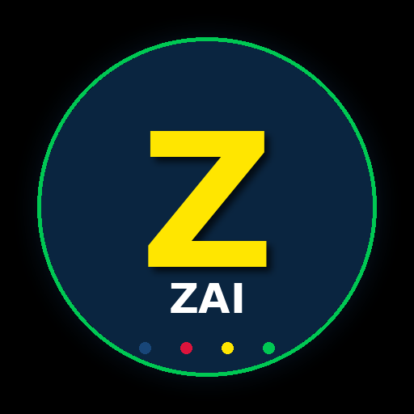

# Z.AI — Native Android Wrapper

A fully functional, highly optimized native Android wrapper app for **[chat.z.ai](https://chat.z.ai)** — Zhipu AI's agentic chat platform. Built in Kotlin with Material Design 3, a cinematic AMOLED theme, and a 4-color signature palette (Deep Blue, Crimson Red, Neon Yellow, Emerald Green).

Since Zhipu AI does not ship an official native Android client, this app wraps the web experience into a fast, native-feeling Android shell — hiding browser chrome, handling camera/file uploads natively, supporting swipe-to-refresh, and giving the user a real Android back-button flow with exit confirmation.

<p align="center">
  
</p>

---

## ✨ Features

### Core
- ⚡ **Highly optimized WebView** — hardware-accelerated layer, DOM storage, JS, cache, cookies (incl. third-party) enabled for seamless Agentic & Chat mode performance.
- 🧭 **In-app navigation** — all `z.ai` and external `http(s)` links stay inside the app instead of bouncing to the default browser.
- 🪣 **State restoration** — WebView state survives configuration changes / process death.
- 🔒 **Mixed-content blocked** — `MIXED_CONTENT_NEVER_ALLOW` for security.

### UI / UX — Material Design 3 + Cinematic AMOLED
- 🎨 **MD3 dark theme** — `Theme.Material3.Dark.NoActionBar` base, AMOLED-black `#000000` backgrounds.
- 🌈 **4-color signature palette**:
  | Color | Hex | Used in |
  |---|---|---|
  | Deep Blue | `#0A2540` | Progress bar background, primary surface |
  | Crimson Red | `#DC143C` | Splash loader, SwipeRefresh spinner cycle |
  | Neon Yellow | `#FFE600` | Progress bar fill, "Z" lettermark |
  | Emerald Green | `#00C853` | Floating Action Button, accent ring |
- 🖤 **Edge-to-edge immersive chrome** — system bars tinted to AMOLED black.
- 💫 **Custom splash screen** with cinematic fade-in animation.
- 🎬 **FAB reveal animation** — home FAB fades in 800ms after launch.

### Advanced
- 🪄 **JavaScript DOM injection** — hides the website's default desktop/mobile headers & footers via a `MutationObserver` + 2-second interval re-application, so the SPA never re-renders them after route changes.
- ⬇️ **SwipeRefreshLayout** — pull-to-reload the agent screen, with all 4 palette colors cycling through the spinner.
- 📷 **Native file uploads + camera capture** — `WebChromeClient.onShowFileChooser` returns both file picker and camera capture intents; supports multi-file selection and `EXTRA_ALLOW_MULTIPLE`.
- 🎤 **WebRTC permission handling** — `onPermissionRequest` grants `VIDEO_CAPTURE` after runtime CAMERA permission is obtained.
- ↩️ **Hardware back button** — walks WebView history first; shows an MD3 exit dialog at root.
- 🏠 **Home FAB** — tap to go home / go back; long-press to reload.
- 📊 **Top progress bar** — thin (3dp) neon-yellow-on-deep-blue bar tracks page loads.

---

## 📱 Screenshots

> Add your screenshots to a `/screenshots/` folder and reference them here.

| Splash | Main (Agent view) | Pull to refresh | Exit prompt |
|---|---|---|---|
| _TODO_ | _TODO_ | _TODO_ | _TODO_ |

---

## 🛠 Tech Stack

| Layer | Technology |
|---|---|
| Language | Kotlin 1.9.24 |
| Build | Gradle 8.7 (Kotlin DSL) |
| Android Gradle Plugin | 8.5.0 |
| Min SDK | 24 (Android 7.0) |
| Target SDK | 34 (Android 14) |
| UI | Material Design 3 (`com.google.android.material:material:1.12.0`) |
| Widgets | `SwipeRefreshLayout`, `FloatingActionButton`, `ConstraintLayout` |
| Splash | `androidx.core:core-splashscreen:1.0.1` |
| Image loading | FileProvider + `Intent.ACTION_GET_CONTENT` + `MediaStore.ACTION_IMAGE_CAPTURE` |

---

## 📦 Project Structure

```
zai-wrapper/
├── app/
│   ├── build.gradle.kts
│   └── src/main/
│       ├── AndroidManifest.xml
│       ├── java/com/zai/wrapper/
│       │   ├── MainActivity.kt        # WebView + file chooser + back nav
│       │   └── SplashActivity.kt      # Fade-in splash → MainActivity
│       └── res/
│           ├── drawable/               # ic_home, ic_launcher_foreground
│           ├── layout/                 # activity_main, activity_splash
│           ├── mipmap-{mdpi..xxxhdpi}/ # Zhipu AI launcher icons (all densities)
│           ├── mipmap-anydpi-v26/      # Adaptive icon XMLs
│           ├── values/                 # colors, strings, themes
│           └── xml/file_paths.xml      # FileProvider paths for camera capture
├── build.gradle.kts
├── settings.gradle.kts
├── gradle.properties
├── gradle/wrapper/                     # Gradle wrapper jar + properties
├── gradlew / gradlew.bat
└── .gitignore
```

---

## 🚀 Build From Source

### Prerequisites
- Android Studio Iguana+ (or just JDK 17 + Android SDK 34)
- Android SDK Platform 34 + Build Tools 34.0.0
- JDK 17

### Steps

```bash
# 1. Clone
git clone https://github.com/The-JDdev/Zai-app.git
cd Zai-app

# 2. Point to your Android SDK (if not using Android Studio)
echo "sdk.dir=/path/to/your/Android/Sdk" > local.properties

# 3. Build debug APK
./gradlew :app:assembleDebug

# 4. Find the APK
ls app/build/outputs/apk/debug/app-debug.apk
```

Install on a connected device:
```bash
adb install app/build/outputs/apk/debug/app-debug.apk
```

---

## 📥 Download APK

Grab the latest debug APK from the [**Releases**](../../releases) page.

> The debug APK is signed with the Android debug keystore, so it installs on any device with "Install unknown apps" enabled for your file manager / browser.

---

## 🔧 Customization

### Change the logo
The launcher icon is generated by a Python script using Pillow. To re-skin:

```bash
# Edit the palette / design in scripts/gen_zhipu_icon.py
pip install pillow
python scripts/gen_zhipu_icon.py
```

All density buckets (`mdpi` → `xxxhdpi`), the adaptive-icon XML, and the 512×512 Play Store master regenerate automatically.

### Tune the JS chrome-hider
If `chat.z.ai` updates its DOM class names and headers start reappearing, edit the `hideChromeJs` string in `MainActivity.kt`:

```kotlin
private val hideChromeJs = """
    (function() {
        function hideChrome() {
            var selectors = [
                'header', 'footer',
                '[class*="DesktopHeader"]', '[class*="MobileHeader"]',
                // ... add new selectors here
            ];
            // ...
        }
    })();
""".trimIndent()
```

### Change the target URL
Edit `targetUrl` at the top of `MainActivity.kt`:

```kotlin
private val targetUrl = "https://chat.z.ai"  // ← change this
```

---

## 🔐 Permissions

| Permission | Why |
|---|---|
| `INTERNET` | Load chat.z.ai |
| `ACCESS_NETWORK_STATE` | Future offline detection |
| `CAMERA` | Native camera capture for file uploads + WebRTC video |
| `RECORD_AUDIO` / `MODIFY_AUDIO_SETTINGS` | WebRTC voice input |
| `READ_EXTERNAL_STORAGE` (≤ SDK 32) / `READ_MEDIA_*` (SDK 33+) | File picker access |
| `WRITE_EXTERNAL_STORAGE` (≤ SDK 29) | Legacy camera capture target on older Android |

All permissions are requested at runtime when the corresponding feature is first used.

---

## 🤝 Contributing

PRs welcome! Please:
1. Fork → feature branch (`feat/my-feature`)
2. Run `./gradlew :app:assembleDebug` to verify it builds
3. Open a PR with a clear description

---

## 📄 License

MIT — see [LICENSE](LICENSE).

---

## ⚠️ Disclaimer

This is an **unofficial** community wrapper. "Zhipu AI", "Z.AI", and related marks belong to their respective owners. This project does not claim any affiliation with or endorsement by Zhipu AI. The app simply loads `https://chat.z.ai` inside a native Android WebView shell — all AI processing happens on Zhipu's servers exactly as it would in a browser.

Use of the underlying service is subject to Zhipu AI's Terms of Service.

---

<p align="center">
  Built with ❤️ by <a href="https://github.com/The-JDdev">The-JDdev</a>
</p>
